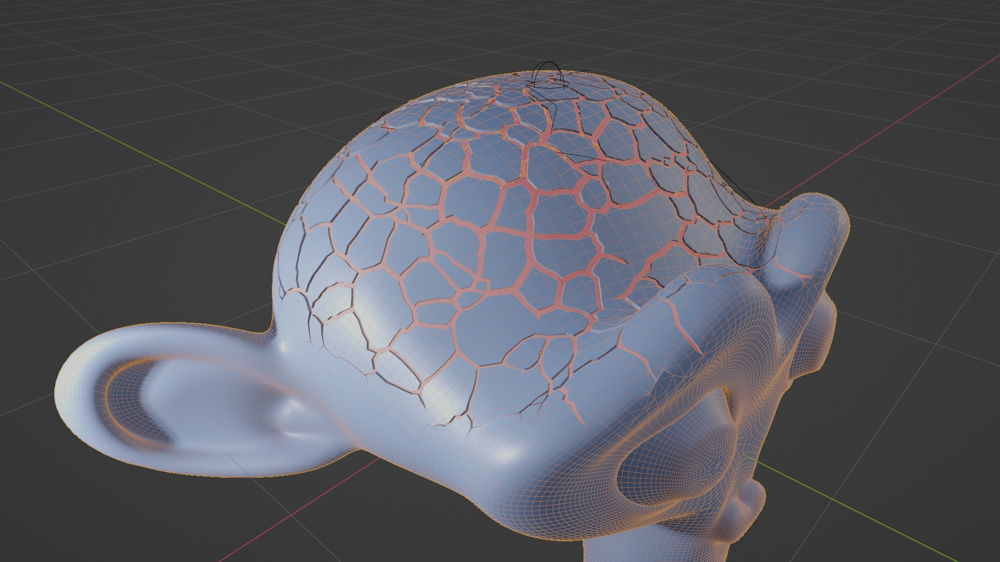
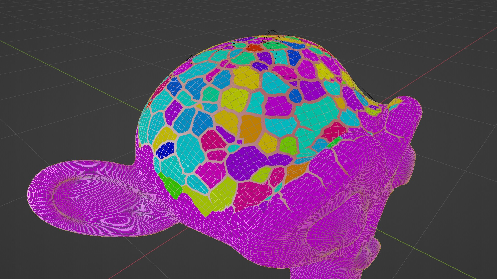
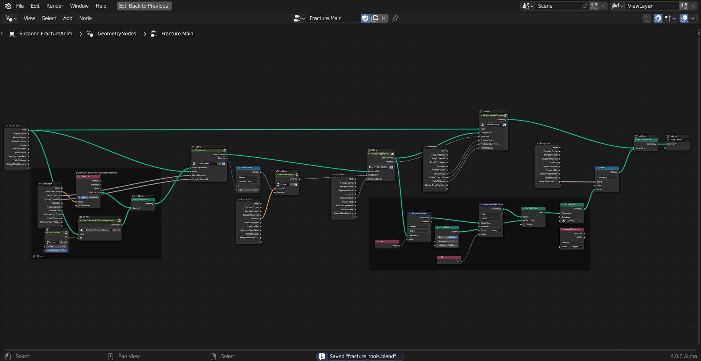

# Fracture Tools

A set of node assets to fracture a mesh based on input curves and other methods.

* Modular node assets that can be used as a single system or combined in parts.
* Supports various user inputs such as:
    - Manually edited curves
    - Physics simulation of stress fracture
    - Texture ID masks
* Fracture propagation and animation support
* Attribute outputs for further processing

    

    

## Fracture Net

Before generating fractures on the mesh itself, the various inputs are unified into a "Fracture Net". The fracture net is a curve geometry with aligned end points and intersections. This makes the subsequent fracturing steps more 

